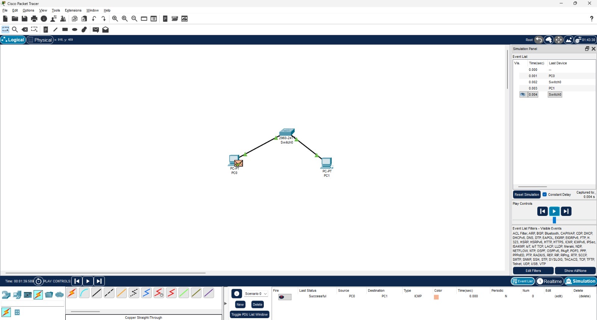

# Cisco Packet Tracer – Basic LAN Setup  

## 📌 Project Overview  
This project demonstrates a **basic Local Area Network (LAN) setup** using **Cisco Packet Tracer**.  
The topology consists of two PCs connected via a switch. The goal is to configure devices, assign IP addresses, and test connectivity between end hosts using **ICMP (ping)**.  

## 🔧 Tools & Technologies  
- Cisco Packet Tracer  
- Switch: Cisco 2960-24TT  
- End Devices: PC0, PC1  
- Copper Straight-Through cables  

## 📂 Project Features  
- Basic LAN topology design  
- Cabling between devices  
- IP address assignment on PCs  
- Connectivity testing using `ping` (ICMP protocol)  

## 🚀 How to Run  
1. Download and open the `.pkt` file in **Cisco Packet Tracer**.  
2. Configure IP addresses for the PCs:  
   - PC0 → `192.168.1.1 /24`  
   - PC1 → `192.168.1.2 /24`  
3. Open the **Command Prompt** on each PC and ping the other device.  
4. Verify successful communication.  

## 📸 Network Topology  
  

## ✅ Results  
- Successfully tested communication between PC0 and PC1.  
- Demonstrated how a switch enables LAN communication.  
- Basic foundation for further networking projects (e.g., VLANs, routing, DHCP).  
